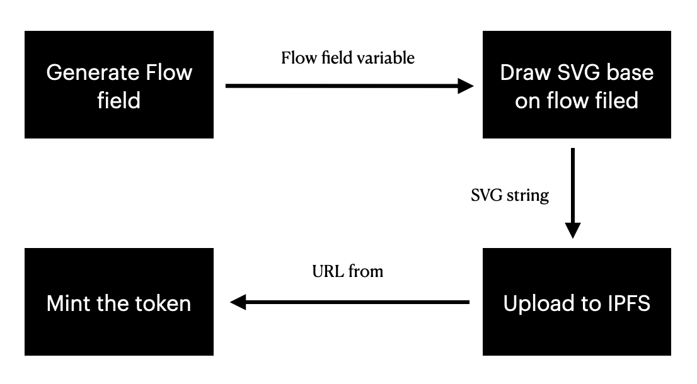

# 🗿 CryptoMural

CryptoMural is an NFT generative art for your Twitter header using Flow Field pathfinding algorithm on Zilliqa blockchain.

[Try it by yourseft](https://cryptomural.web.app/) |  [Report a bug, request a feature or provide a feedback](https://github.com/chunza2542/cryptomural/issues)

## Demo

<iframe width="560px" height="315px" style="border-radius: 10px;" src="https://www.youtube.com/embed/TYfHlT0xnaE" title="YouTube video player" frameborder="0" allow="accelerometer; autoplay; clipboard-write; encrypted-media; gyroscope; picture-in-picture" allowfullscreen></iframe>

## How it works

### Minting

In this project, when user generate thier token, Javascript on browser will generate svg string base on Flow Field pathfinding algorithm then upload it to IPFS. After that, the IPFS url will be use for mint the token via contract on Zilliqa chain. As soon as the transaction complete, the image will be show on the interface. 

### Gallery exhibition

In this section, we use `@zilliqa-js/zilliqa` module to retrieve the contract state. We filter all token url with user's address from ZillPay wallet and then show it on screen.

## Roadmap

- [x] Develop the MVP.
- [x] Launch on test net for getting the feedback.
- [ ] Add more shape and color.
- [ ] Create community on twitter.
- [ ] Lauch on main net.
- [ ] Develop the market place.
- [ ] Build community tools such as Changing header from our website etc.

---

Crafted with 🧡 by [@chunza2542](https://twitter.com/chunza2542) and [@tauhoo_ice](https://twitter.com/tauhoo_ice)
